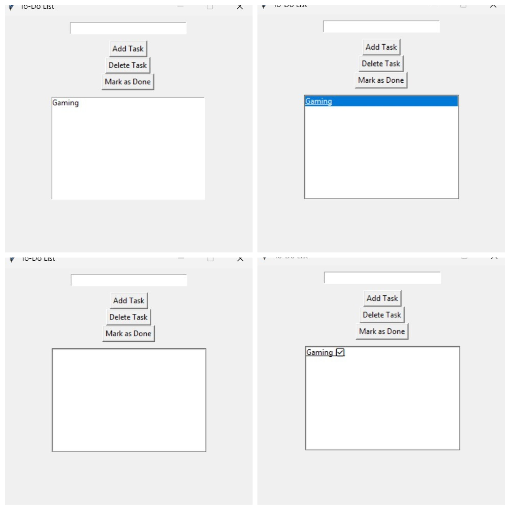

# Task 3 – To-Do List GUI App 📝

This is a graphical To-Do List application built using Python’s Tkinter library.  
It allows users to manage daily tasks with a simple and interactive interface.  
The app supports task addition, deletion, completion marking, and automatic saving to a file.

---

## 🔧 Features

- ✅ Add new tasks via input box
- 🗑️ Delete selected tasks
- ✅ Mark tasks as completed (adds ✅ at the end)
- 💾 Auto-save tasks to a local file on exit
- 📂 Loads saved tasks on next startup
- 🖥️ Simple and user-friendly interface

---

## ▶️ How to Run

1. Make sure Python 3.x is installed.
2. Save the file as `todo_gui.py`
3. In terminal or command prompt:

```bash
python todo_gui.py

```
## Sample GUI Output



## 💻 Technologies Used

 - Python 3.x
 -  Tkinter (built-in GUI library)
 - Text file for persistent task storage
